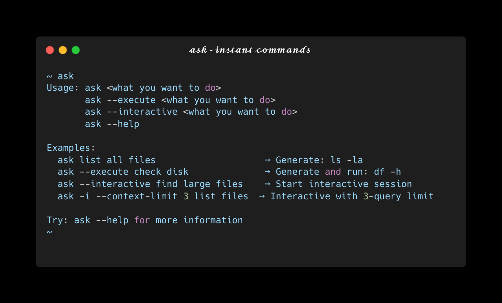
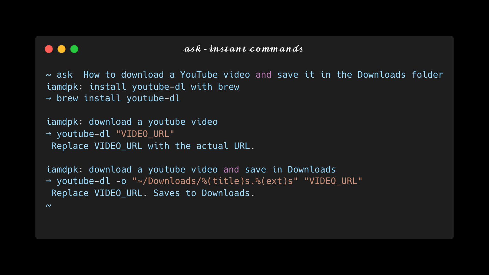
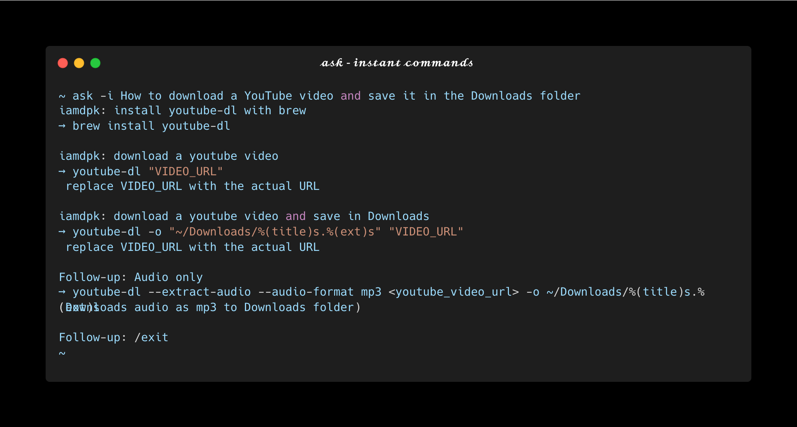
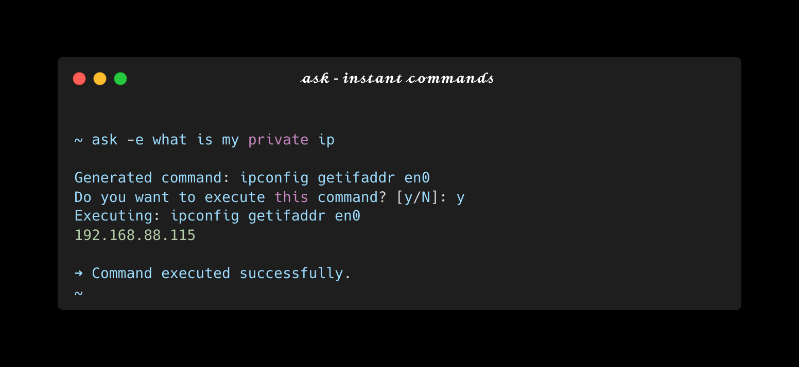
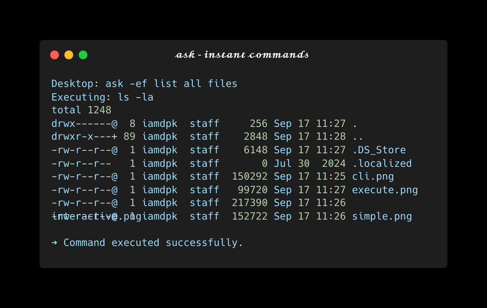

# Ask CLI

**Instant terminal commands powered by AI**

Transform natural language into terminal commands instantly. No more googling command syntax or remembering complex flags!

<div align="center">
  
</div>

## Table of Contents

- [Features](#features)
- [Quick Examples](#quick-examples)
- [Installation](#installation)
- [Usage](#usage)
- [Setup](#setup)
- [Updating](#updating)
- [License](#license)

## Features

- **AI-Powered**: Convert natural language to precise terminal commands
- **Instant Results**: Get commands immediately without searching
- **Interactive Mode**: Review and confirm commands before execution
- **Smart Context**: Understands your intent and provides relevant commands
- **Safe Execution**: Always shows commands before running them

## Quick Examples

<div align="center">
  
</div>

```bash
$ ask how to list all files
→ ls -la

$ ask find large files over 100MB
→ find . -type f -size +100M

$ ask compress this folder
→ tar -czf archive.tar.gz .
```

## Installation

### Quick Install (Recommended)

```bash
# Download and install
curl -sSL https://raw.githubusercontent.com/sjdpk/ask-cli/main/install.sh | bash
```

### Manual Install

```bash
# Clone repo
git clone https://github.com/sjdpk/ask-cli.git
cd ask-cli

# Run installer
./install.sh
```

### Uninstallation

```bash
# Quick uninstall
curl -sSL https://raw.githubusercontent.com/sjdpk/ask-cli/main/uninstall.sh | bash
```

Or manually:

```bash
# Remove CLI and all files
rm ~/.local/bin/ask
rm -rf ~/.ask-cli
```

**Note:** This preserves your API key configuration (`~/.ask_config.json`) unless you delete it manually.

## Usage

```bash
ask <what you want to do>
```

### Interactive Mode

Ask CLI provides an interactive mode where you can review commands before execution:

<div align="center">
  
</div>

### Command Execution

See your commands in action with clear execution feedback:

<div align="center">
  
</div>

### More Examples

```bash
ask list all files                    # → ls -la
ask check disk space                  # → df -h
ask find text in files                # → grep -r "text" .
ask kill process on port 3000         # → lsof -ti:3000 | xargs kill -9
ask compress folder                   # → tar -czf archive.tar.gz folder
ask show running processes            # → ps aux
ask find files modified today         # → find . -type f -mtime 0
ask check memory usage               # → free -h
```

### Additional Commands

```bash
ask --help      # Show help information
ask --reset     # Reset your API key
ask --update    # Update to the latest version
ask --force     # Execute commands without confirmation
```

#### Force Execution Mode

For advanced users who want to skip confirmation prompts:

<div align="center">
  
</div>

## Setup

Getting started with Ask CLI is simple:

1. **Get a free API key** from [Google AI Studio](https://makersuite.google.com/app/apikey)
2. **Run your first command**: `ask list files`
3. **Enter your API key** when prompted
4. **Start asking!** The CLI is now ready to use

> **Tip**: Your API key is stored securely and only used for generating commands. Use `ask --reset` to change it anytime.

## Updating

Keep your Ask CLI up to date with the latest features and improvements:

```bash
ask --update
```

This command will automatically download and install the latest version from GitHub while preserving your configuration.

## License

MIT License

---

<div align="center">
  <p>Made with care for developers who love efficiency</p>
  <p>
    <a href="https://github.com/sjdpk/ask-cli/issues">Report Bug</a> •
    <a href="https://github.com/sjdpk/ask-cli/issues">Request Feature</a> •
    <a href="https://github.com/sjdpk/ask-cli">⭐ Star on GitHub</a>
  </p>
</div>
